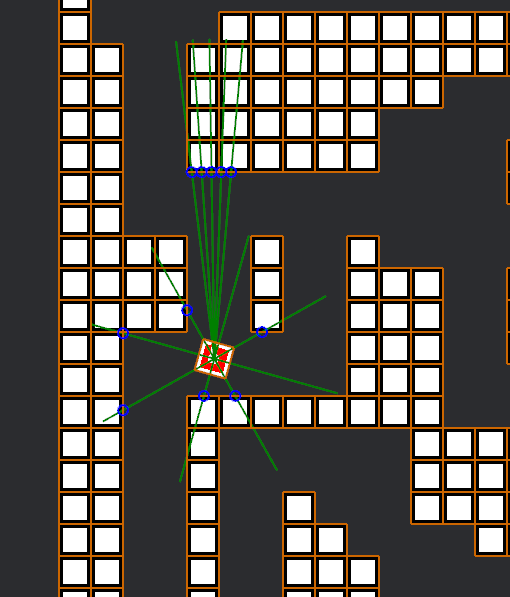

# tank_game: AI Competition Game Engine

This repository contains **tank_game**, a customizable framework designed for an AI competition where players program and compete using autonomous tanks. The goal of the game is simple: **the last tank standing wins**.

### Key Features:
- **REST API Integration**: Players control their tanks by developing a REST API that interacts with the game engine. Each tank is driven by the AI logic provided via the API, allowing full control over movement, turret rotation, and shooting.
  
- **AI Flexibility**: The AI controlling each tank can range from a simple decision tree using basic conditional logic (if-else statements) to a sophisticated machine learning model for advanced strategies.
  
- **Survival Objective**: The game operates as a survival challenge where players compete to keep their tank alive while eliminating the opponent. The last surviving tank is declared the winner.

- **Optional Player Mode**: Players can opt to play against their own AI-driven tank to test and refine strategies.

This game engine serves as the foundation for participants to develop, test, and refine their AI models in a competitive yet accessible environment.

# Set Up

## Prerequisites
1. Install [Rust](https://www.rust-lang.org/tools/install) if you want to compile the game from source.
2. Clone this repository and navigate into the project directory.

## Downloading a Release

For convenience, you can download a pre-built release of the game without needing to compile it yourself. Visit the [Releases](https://github.com/uocsclub/tank_game/releases) page and download the latest version for your platform.

After downloading, extract the files and ensure the `assets` folder is in the same directory as the executable.

## Compilation (Optional)

If you prefer to compile the game yourself, use the following command in the terminal:

```
cargo build [--features "debug cinematic"]
```

**Features**
- `debug`: Enables additional debugging information for troubleshooting.
- `cinematic`: Activates cinematic effects within the game.

Specify any optional features in the command. You may omit `--features` if you do not wish to enable any optional features.

## Adding Assets

After compiling, copy the `assets` folder to the same directory as the executable:

## Running the Game

1. **Start AI Servers (Optional):**  

If you want to use AI for players, start your AI servers for player 1 and player 2 before launching the game. Alternatively, if you prefer manual control, you can use keyboard inputs instead.

2. **Launch the Game:**  

Run the game with:
```
cargo run [-- <optional_params>]
```
Or, if you’ve compiled a binary:
```
./game [-- <optional_params>]
```
For a list of supported parameters, see the [Command Line Arguments](#command-line-arguments) section.

# Command Line Arguments

The `tank_game` engine allows customization of game settings through various command-line arguments. Below is a list of all available optional arguments, along with their default values if not specified.

## Optional Arguments

### `-r` or `-render`
- **Description**: Enables or disables rendering in the game engine.
- **Values**:
  - `t` or `true` – enables rendering.
  - `f` or `false` – disables rendering (headless mode).
- **Default**: `true` (Rendering is enabled by default).

---

### `-p1` or `-player_1`
- **Description**: Specifies the control scheme for Player 1.
- **Values**:
  - `wasd` – controls Player 1 using the `W`, `A`, `S`, `D` keys.
  - `arrow` – controls Player 1 using the arrow keys.
  - `<IP>:<Port>` – controls Player 1 using a REST API running on the specified IP address and port.
- **Default**: `wasd` (Player 1 uses `W`, `A`, `S`, `D` keys by default).

---

### `-p2` or `-player_2`
- **Description**: Specifies the control scheme for Player 2.
- **Values**:
  - `wasd` – controls Player 2 using the `W`, `A`, `S`, `D` keys.
  - `arrow` – controls Player 2 using the arrow keys.
  - `<IP>:<Port>` – controls Player 2 using a REST API running on the specified IP address and port.
- **Default**: `arrow` (Player 2 uses arrow keys by default).

### `-map`
- **Description**: Specifies the game map.
- **Values**:
  - `<name_of_map>.ron` – Name of map file.
  - `random` or `None` – Pick a random map.
- **Default**: `None` (A random map is selected).

### `-dt`, `-delta_time`, `-t`, or `-time`
- **Description**: Sets the time step (delta time) between frames in milliseconds, allowing control over the game's simulation speed.
- **Values**:
  - Any positive whole number – specifies the time step in milliseconds (e.g., `16` for approximately 60 frames per second).
  - `default` – resets to the default delta time between frames.
- **Default**: The default delta time between frames (used if not specified).


---

## Usage Example

```bash
# Run the game with default settings (rendering enabled, Player 1 using WASD, Player 2 using arrow keys)
./tank_game

# Run the game in headless mode (no rendering)
./tank_game -r false

# Set Player 1 to use WASD keys and Player 2 to use a REST API at 127.0.0.1:8080
./tank_game -p1 wasd -p2 127.0.0.1:8080
```


# AI API

The AI REST API includes the following routes:

## 1. Start Game
- **Endpoint**: `POST /start_game`
- **Description**: Initializes a new game instance.
- **Expected Input**: 
  - JSON object containing the game data structure, including:
    - `game_id`
    - Initial tank position
- **Response**: HTTP response with a 200 series code.

## 2. Brain Function
- **Endpoint**: `POST /brain`
- **Description**: Processes the current game state and determines the next action for the tank.
- **Expected Input**: 
  - JSON object containing the AI's sensor data.



```rust
{
  "game_id": str,                       // Unique identifier for the game instance
  "pos": Tuple[f32, f32],               // Tank's position in the game world (x, y coordinates)
  "rot": f32,                           // Current rotation angle of the tank in radians
  "turret_rot": f32,                    // Current rotation angle of the turret in radians
  "turret_vision": List[{"Wall": f32} | {"Enemy": f32} | null; 5], // Vision data for the turret
  "hull_vision": List[{"Wall": f32} | {"Enemy": f32} | null; 8]  // Vision data for the hull
}
```

### Field Descriptions
- **game_id**: Unique string identifier for the game session.
- **pos**: A tuple representing the tank's position in the game world (x, y coordinates).
- **rot**: Current rotation angle of the tank in radians.
- **turret_rot**: Current rotation angle of the turret relative to the tank, in radians.
- **turret_vision**: 
  - Array containing up to five objects or `null` values representing distances to obstacles detected by the turret.
  - Each object contains:
    - **Wall**: Distance to the nearest wall (float).
    - **Enemy**: Distance to the nearest enemy (float).
    - `null` indicates an area that is not visible.
- **hull_vision**: 
  - Array containing up to eight objects or `null` values indicating distances to walls or enemies detected by the tank’s hull.
  - Order: N, NW, W, SW, S, SE, E, NE.

This structured data format enables the AI to make informed decisions based on the tank's position, orientation, and surroundings.

- **Response**: JSON object in the format `{"action": "some action"}`
- **Expected Actions**:
  - `"shoot"`: Fires the turret at an enemy.
  - `"move_forward"`: Moves the tank forward.
  - `"move_backward"`: Moves the tank backward.
  - `"rotate_left"`: Rotates the tank to the left.
  - `"rotate_right"`: Rotates the tank to the right.
  - `"spin_left"`: Spins the turret to the left.
  - `"spin_right"`: Spins the turret to the right.
  - `"wait"`: Takes no action.

## 3. Win Condition
- **Endpoint**: `POST /win`
- **Description**: Called when the tank wins the game.
- **Expected Input**: JSON object containing game data (optional).
- **Response**: HTTP response with a 200 series code.

## 4. Loss Condition
- **Endpoint**: `POST /loss`
- **Description**: Called when the tank loses the game.
- **Expected Input**: JSON object containing game data (optional).
- **Response**: HTTP response with a 200 series code.

# Game Engine To-Do List

## Rendering
- [X] **Optional Rendering**  
  - Implement **headless mode** for the game engine, to run without rendering.
  - Set up **default rendering** mode with visual outputs.

## User Input Processing
- [X] **Movement**  
  - Implement player-controlled movement inputs for tanks.
- [X] **Turret Rotation**  
  - Add controls to rotate turrets based on user input.
- [X] **Shooting**  
  - Allow user-triggered shooting action via inputs.

## Sensor Inputs
- [X] **Hull Ray Casts**  
  - Implement hull ray casting for detecting objects.
- [X] **Turret Hull Ray Casts**  
  - Set up ray casts originating from the turret to detect enemies.

## Shooting Mechanism
- [X] **Bullet Generation**  
  - Create bullet instances when the player shoots.
- [X] **Bullet Destruction**  
  - Destroy bullet on impact with tank or wall.
- [X] **Tank Destruction**  
  - Destroy enemy tanks upon being hit by a bullet.
- [X] **End Game Logic**  
  - Update game state when a tank is destroyed and determine the winner.

## Collision Handling
- [X] **Wall and Tank Collisions**  
  - Implement collision detection to prevent tanks from moving through walls and other tanks.

## Player Inputs
- [X] **Keyboard Inputs**  
  - Set up controls using keyboard input to move and interact.
- [X] **REST API Inputs**  
  - Integrate support for controlling the game using REST API inputs.

## Sounds (SECONDARY)
- [ ] **Shooting Sound Effect**  
  - Play sound effects when shooting.
- [ ] **Explosion Sound Effect**  
  - Trigger explosion sound when a tank or bullet is destroyed.

## Integration Tests
- [ ] **Headless Mode Test**  
  - Verify the game engine runs correctly in headless mode.
- [ ] **Rendering Mode Test**  
  - Test if the game works correctly in rendering mode.
